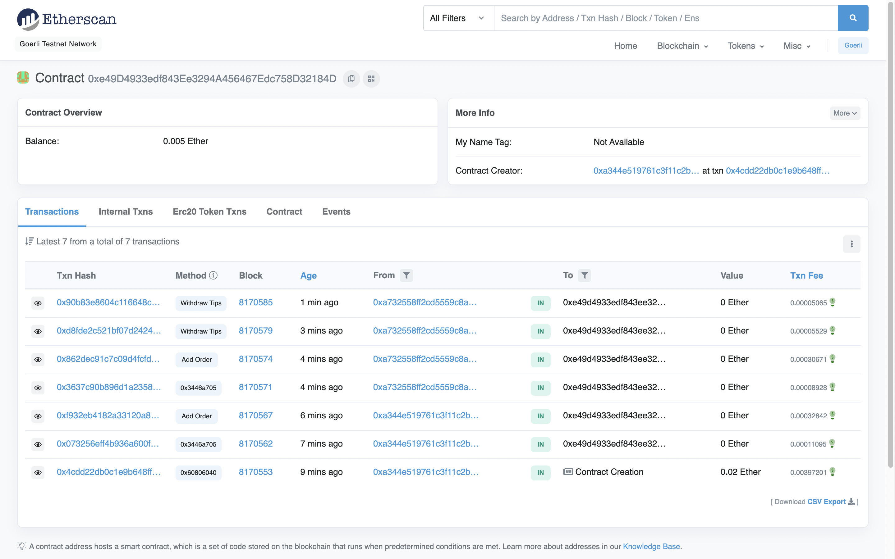
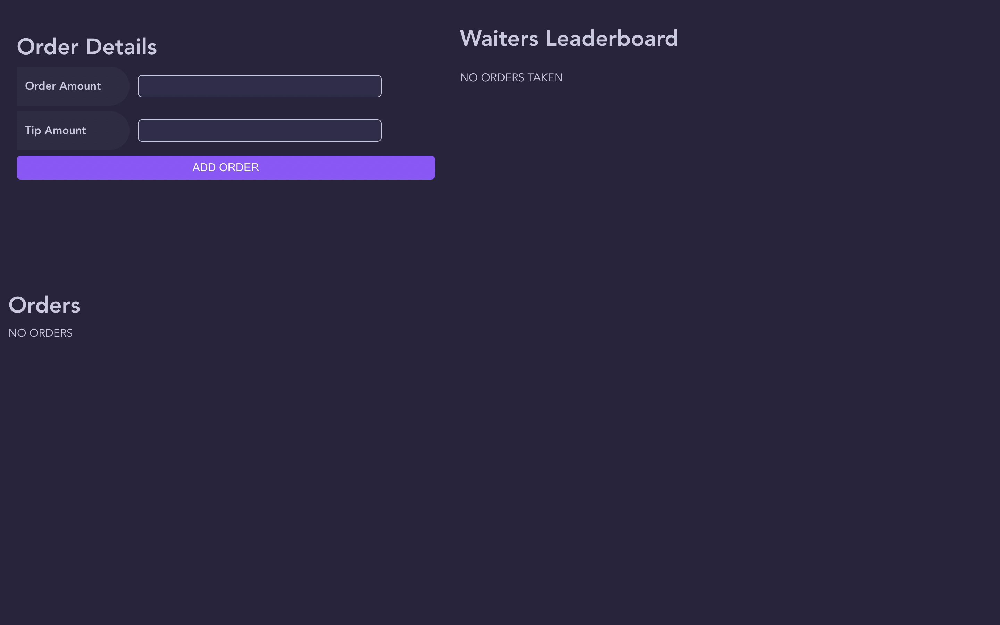
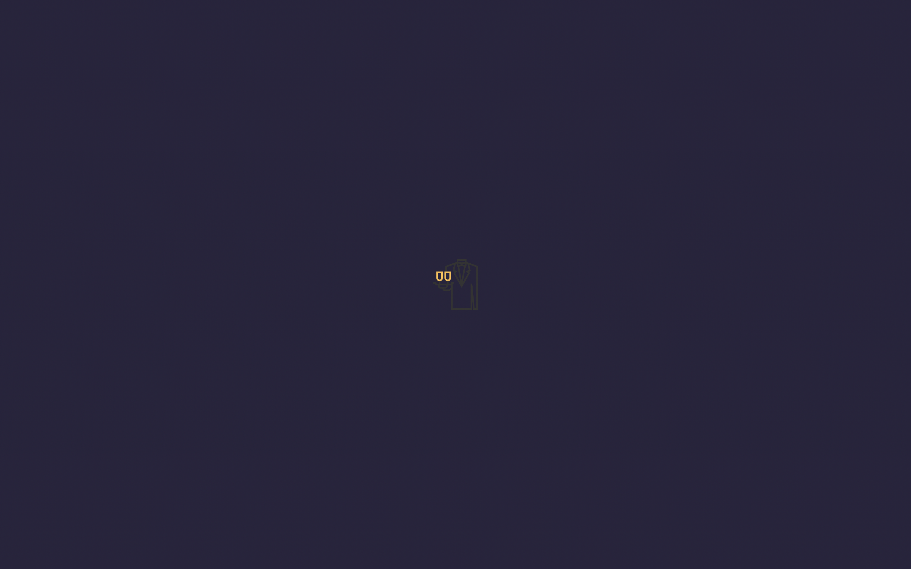
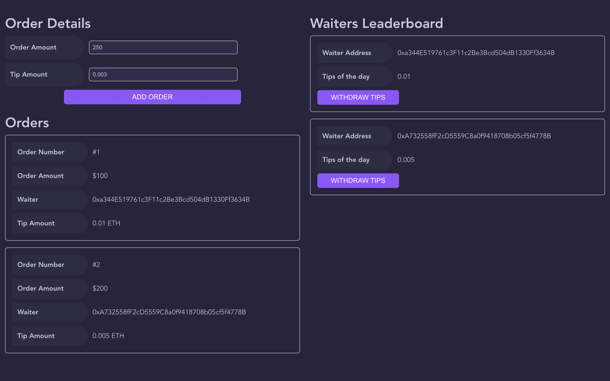
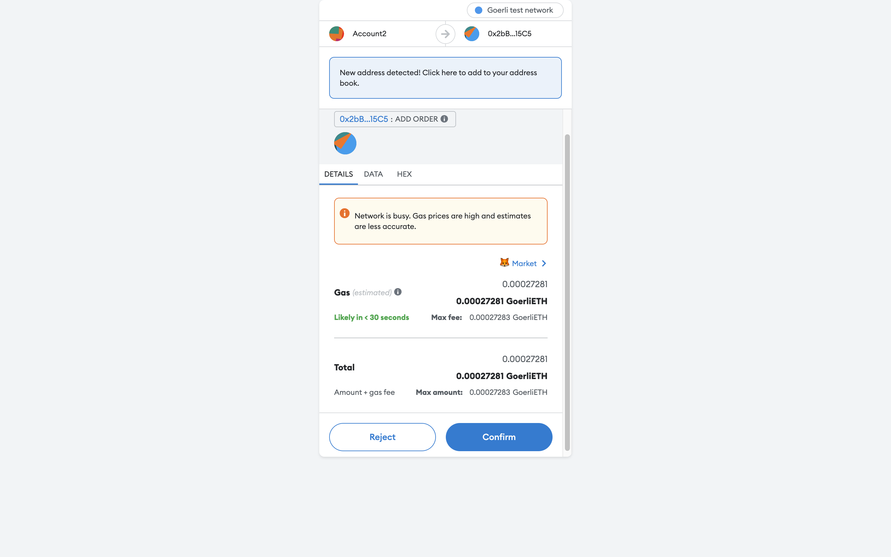
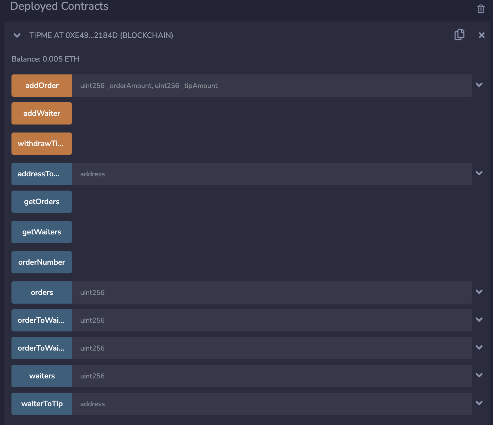
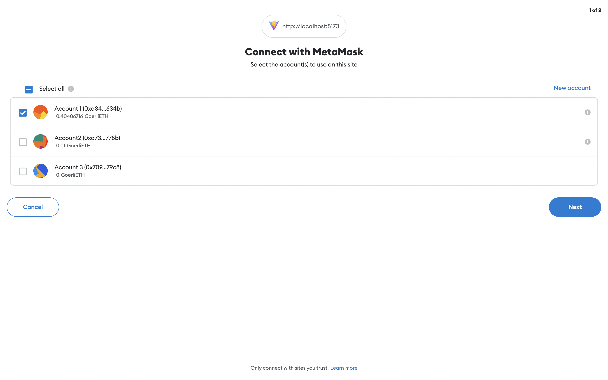

# Tip-Management-System-Dapp

## Screenshot of the application

#### Connect wallet screen :  
  

#### Goerli etherscan - Smart contract screenshot :  
  

#### Initial UI of the app :  
  

#### Loading screen :  
  

#### Tip Management application :  
  

#### Metamask wallet interaction:  
  

#### Testing code in remix :  
  

#### Metamask wallet connection:  
  

